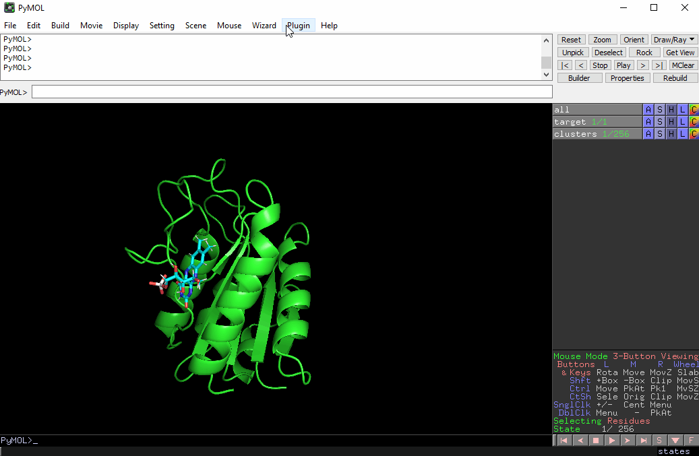

# PyViewDock


[](https://pymolwiki.org)
[](https://www.python.org/)

A [PyMOL](https://pymolwiki.org) plug-in that adds capabilities to this molecular viewer to manage result files from docking.  
Obviously inspired from the original [Chimera's View-Dock](https://www.cgl.ucsf.edu/chimera/docs/ContributedSoftware/viewdock/framevd.html)





### Supported formats with software/server results

* [AutoDock Vina](https://autodock-vina.readthedocs.io) \
    `.pdbqt`
* [Swiss-Dock](https://www.swissdock.ch) \
    `.dock4` / `.pdbqt` (Attracting Cavities / AutoDock Vina) \
    .chimerax / .pdb in Dock 4+ format (legacy EADock DSS)
* [pyDock](https://life.bsc.es/pid/pydock) \
    `.ene` / `.eneRST` and corresponding .pdb
* generic xyz \
    `.xyz`


### Requirements

PyMOL 2.x/3.x with PyQt5

For [incentive PyMOL](https://pymol.org/) PyQt5 is already included.  
In the case of [open-source PyMOL](https://github.com/schrodinger/pymol-open-source), it is advised ensure to have installed PyQt5: `python -m pip install pyqt5 --user`


### Installation

Easy intallable. Open PyMOL and use it's [plugin manager](https://pymolwiki.org/index.php/Plugin_Manager): `Plugin > Plugin Manager > Install New Plugin`

You can [download a zip](https://github.com/unizar-flav/PyViewDock/releases/latest/download/PyViewDock.zip) to install the latest release from a local file or directly provide it an URL:

```
https://github.com/unizar-flav/PyViewDock/releases/latest/download/PyViewDock.zip
```

It is recomended to restart PyMOL after installation, although it should not be necessary.


### Basic Usage

A more detailed guide and usage examples can be found in the [wiki page](https://github.com/unizar-flav/PyViewDock/wiki).

#### GUI

Toggle the plug-in window in `Plugin > PyViewDock`  
Open a PDB file with docked ligands through `File > Open...`

A table will appear with information for every docking entry. It can be column-sorted, show/hide columns and each entry will be displayed at PyMOL when clicked.

#### PyMOL command line

  - Enriched built-in `load` function (also as drag-and-drop):
      * .pdbqt
      * .dock4
      * .chimerax
      * .ene/.eneRST

  - Load PDBQT file (AutoDock Vina): \
      `load_pdbqt  filename [, object ]`

  - Load cluster of docked ligands in PDB format (Dock 4+): \
      `load_dock4  filename [, object [, mode ]]`

  - Load SwissDock's .chimerax file: \
      `load_chimerax  filename [, object ]`

  - Load pyDock's .ene/.eneRST file: \
      `load_pydock  filename [, object [, max_n ]]`

  - Load .xyz file: \
      `load_xyz  filename [, object ]`

  - Export docked entries data to .csv/.txt file: \
      `export_docked_data  filename [, format ]`

  - Align a single structure to every state of an existing multi-state object: \
      `align_multi  mobile, target [, name_new [, initial_state [, final_state [, source_state ]]]]`

### How to cite
  > Boneta, S., _PyViewDock_, 2021, https://github.com/unizar-flav/PyViewDock
